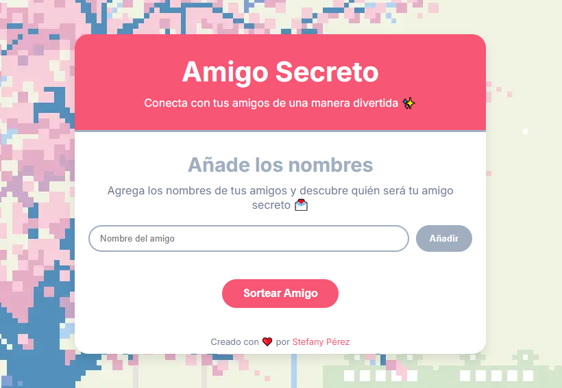

# 🎁 Amigo Secreto - Aplicación de Sorteo

Una aplicación web interactiva para organizar sorteos de amigo secreto de manera fácil y divertida. Permite agregar participantes y realizar un sorteo aleatorio con animaciones y validaciones.

El proyecto fue realizado como práctica del challenge para mejorar la lógica de programación, de **Alura Latam** y **Oracle**, del curso realizado durante la formación de:

- Lógica de programación con JavaScript

---

<p align="center">
  
</p>

---

## ✨ Características Principales

- ✅ Interfaz de usuario intuitiva y responsive
- 🎯 Validación de nombres en tiempo real
- 🎲 Sorteo aleatorio sin repeticiones
- 🔄 Animaciones durante el proceso de sorteo
- 📱 Diseño adaptable a diferentes dispositivos

---

## 🛠️ Funcionalidades

### 1. Gestión de Participantes

- Agregar nombres mediante un campo de texto y botón "Añadir"
- Visualización instantánea de la lista de participantes
- Validaciones de entrada:
  - No se permiten campos vacíos
  - Solo se aceptan letras y espacios
  - Se permiten acentos y ñ (ejemplo: "María", "Señor")
  - No se permiten números ni caracteres especiales
  - No se permiten nombres duplicados

### 2. Sistema de Sorteo

- Botón "Sortear amigo" para iniciar el proceso
- Animación de spinner durante el sorteo
- Revelación dramática del resultado
- Sistema que asegura que:
  - Nadie sea su propio amigo secreto
  - Cada participante recibe y es recibido como amigo secreto
  - El proceso es completamente aleatorio

---

## 🎨 Interfaz de Usuario

La aplicación cuenta con:

- Header con título y logo
- Sección de entrada de datos
- Lista de participantes
- Sección de resultados
- Botones con efectos hover
- Animaciones suaves para mejor experiencia de usuario

## 🔍 Validaciones Implementadas

```javascript
// Ejemplos de nombres válidos:
María
Juan Pablo
José Martínez
Señora López

// Ejemplos de nombres no válidos:
Juan123 (contiene números)
María@ (contiene caracteres especiales)
Pedro_García (contiene guión bajo)
"" (vacío)
```

---

## 🚀 Tecnologías Utilizadas

<p align="center">
  
  
  
</p>

---

## 💡 Lógica de Programación Implementada

- **Arrays**: Almacenamiento y manipulación de la lista de participantes
- **Map**: Gestión de emparejamientos en el sorteo
- **Funciones**: Modularización del código
- **Async/Await**: Manejo de animaciones y tiempos
- **Event Listeners**: Interacción con el usuario
- **Expresiones Regulares**: Validación de nombres
- **Condicionales**: Lógica de validación y sorteo
- **DOM Manipulation**: Actualización dinámica de la interfaz

---

## 📝 Código Ejemplo

```javascript
// Validación de nombres
function validarNombre(nombre) {
  if (!nombre || nombre.trim() === "") {
    alert("Por favor, ingrese un nombre válido");
    return false;
  }

  const patronNombre = /^[a-záéíóúñüA-ZÁÉÍÓÚÑÜ\s]+$/;
  if (!patronNombre.test(nombre)) {
    alert("El nombre solo debe contener letras y espacios");
    return false;
  }

  return true;
}
```

---

## 🔮 Mejoras Futuras

- 📝 Edición de Participantes: Permitir editar los nombres de los participantes en la lista.
- 🚮 Eliminación de Participantes: Agregar un botón para eliminar participantes de la lista.
- ⏪ Reiniciar Sorteo: Añadir un botón para reiniciar el sorteo y comenzar de nuevo fácilmente.
- 🎨 Más Animaciones: Incluir más animaciones para el sorteo, como efectos visuales al revelar resultados.
- 📱 Mejoras de Responsividad: Optimizar la interfaz para que funcione aún mejor en dispositivos móviles.

---

## ⌛​ Challenge

Este proyecto es parte de la formación **ONE - Oracle Next Education**, un programa educativo enfocado en el desarrollo de competencias tecnológicas y profesionales.

Asimismo, constituye un reto planteado por **Alura Latam**, una plataforma de aprendizaje que brinda proyectos prácticos y guías detalladas para reforzar conocimientos en programación y diseño web.

---

## ⭐​ Insignia de logro

Insignia de logro por completar el challenge **Amigo Secreto**

<p align="center">
  
</p>

---

## 👤 Autor

Desarrollado por **Stefany Pérez**  
GitHub: [@StefanyPerezBz](https://github.com/StefanyPerezBz)
